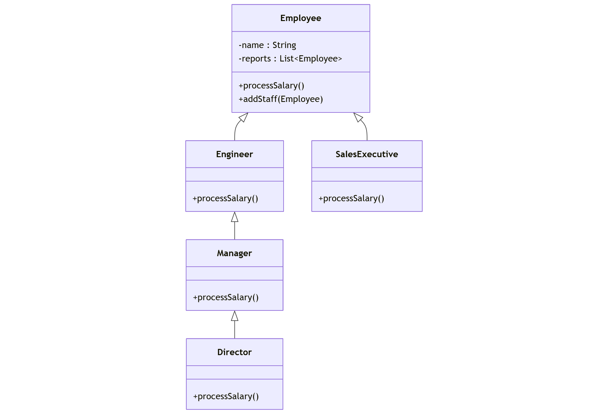
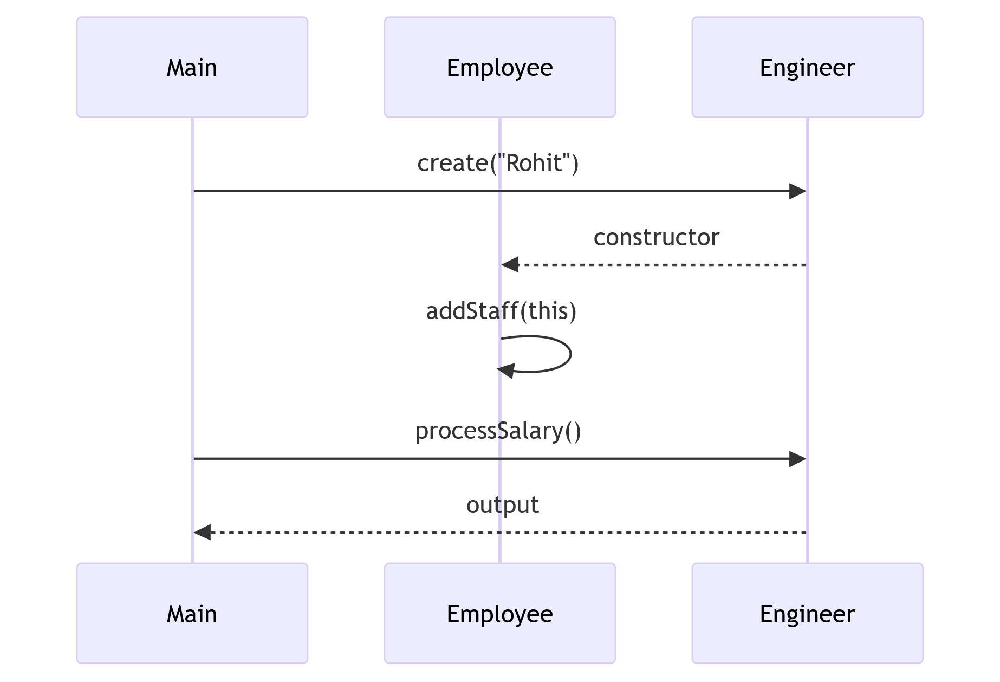

# Staff Salary Processing System

This salary processing application is designed to manage the salary processing for employees within an organization. The organization currently has an engineering division with Engineers, Managers, and Directors. Additionally, it may expand to include other divisions in the future, such as a Sales division.

## Features

**Employee Hierarchy:** The application supports an employee hierarchy consisting of Engineers, Managers, and Directors. Managers can alsowork as Engineers, and Directors can also work as Managers.

**Salary Processing Logic:** Each type of employee (Engineer, Manager, Director) has its own distinct logic for processing salary. Theapplication ensures that the appropriate logic is applied based on the employee type.

**Extensible Design:** The application is designed to be extensible, allowing for the addition of new employee types and divisions in the future. This ensures that the application can accommodate organizational growth and changes in the workforce structure.

## Implementation

The application is implemented in Java and consists of the following classes:

- **Employee:** Abstract base class for all types of employees. It defines avirtual function ProcessSalary() which must be implemented by derivedclasses. It also maintains a static vector staffs to keep track of allemployees.

- **Engineer:** Derived from Employee, represents Engineers in theorganization. Implements the ProcessSalary() function specific toEngineers.

- **Manager:** Derived from Engineer, represents Managers in theorganization. Implements the ProcessSalary() function specific toManagers.

- **Director:** Derived from Manager, represents Directors in theorganization. Implements the ProcessSalary() function specific toDirectors.

- **SalesExecutive:** Derived from Employee, represents Sales Executives in the organization. Implements the ProcessSalary() function specific to Sales Executives.

## Usage

Create instances of employees (Engineers, Managers, Directors, Sales Executives) using their respective constructors.

The ProcessSalary() function for each employee type will be automatically called when processing the salary.

The application is extensible, allowing for the addition of new employee types and divisions by creating new derived classes from the Employee base class and implementing the necessary logic.

## Object-Oriented Programming (OOP) Principles in the Solution

The provided solution for the salary processing application demonstrates the effective application of Object-Oriented Programming (OOP) principles. Below is an analysis of how these principles are utilized:

### Classes and Inheritance

Different types of employees (`Engineer, Manager, Director, SalesExecutive`) are represented using classes. Inheritance is used to establish relationships between these classes, with subclasses inheriting properties and behaviors from their base class. For example, `Manager` inherits from `Engineer`, and `Director` inherits from `Manager`. This hierarchical structure helps to model the organizational hierarchy effectively.

### Abstraction

The Employee class serves as an abstract base class defining a common interface (`ProcessSalary()`) for all employee types. This allows for polymorphism, where different implementations of `ProcessSalary()` can be invoked based on the actual type of the employee object. Abstraction hides the implementation details of salary processing, allowing for flexibility and modularity.

### Polymorphism

Each subclass (`Engineer, Manager, Director, SalesExecutive`) provides its own implementation of the `ProcessSalary()` function, tailored to the specific requirements of that type of employee. This allows for the same method name to be used across different classes, providing flexibility and ease of use. Polymorphism enables the code to handle different types of employees uniformly, simplifying code maintenance and extension.

### Encapsulation

Data members (such as `name_ and reports_`) are encapsulated within each class, ensuring data integrity and limiting access to internal implementation details. Access to these members is controlled through public methods. Encapsulation prevents direct access to the internal state of objects, promoting modularity and reducing the risk of unintended side effects.

### Static Member

The `staffs` vector in the Employee class is declared as static, allowing it to be shared across all instances of the class. This is used to maintain a collection of all employees within the organization, facilitating operations such as processing salaries for all employees. Static members provide a way to share data among all instances of a class, enhancing efficiency and organization.

#### Class Diagram – OOP Structure

#### Sequence Diagram – Method Call/Interaction Order

## **ADD THIS TO RESUME**

**Title:** Salary Processing Application

**Details:**

- Designed and implemented an object-oriented salary processing- application in C++ to efficiently manage the payroll system for an- organization's engineering division.

- Utilized inheritance, abstraction, polymorphism, and encapsulation to- create a modular and extensible solution capable of handling different- employee types and their respective salary processing logic.

- Developed a class hierarchy including Employee, Engineer, Manager,- Director, and SalesExecutive, allowing for easy integration of new- employee types and divisions in the future.

- Demonstrated proficiency in software design principles and problem-solving skills by creating a scalable solution adaptable to organizational growth and changes in workforce structure.
